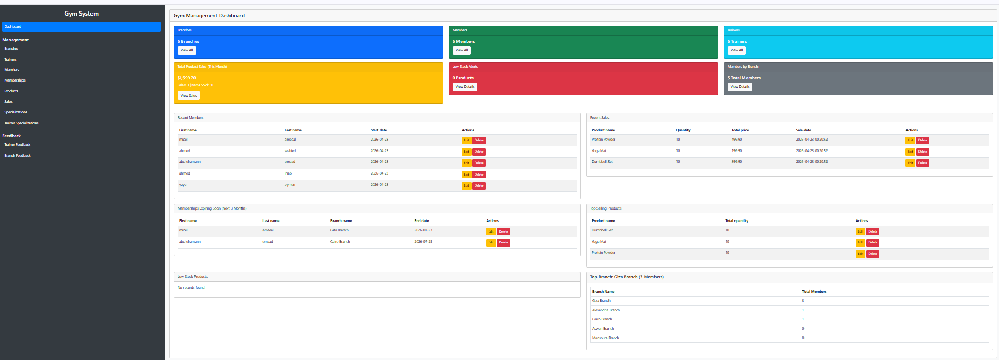
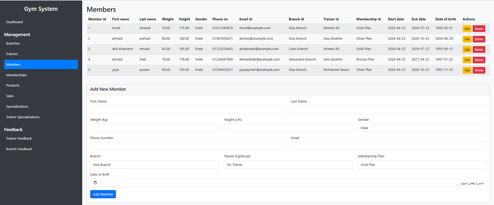
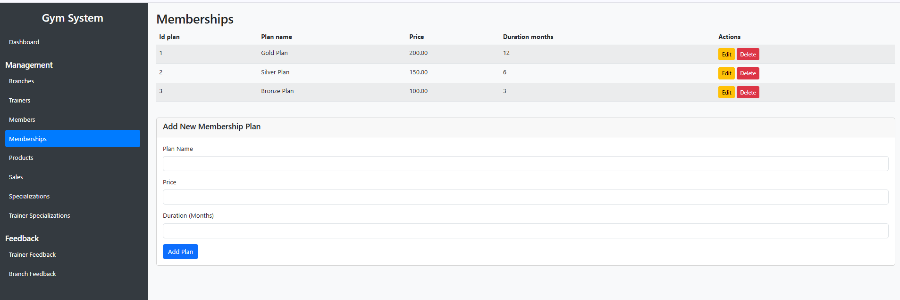
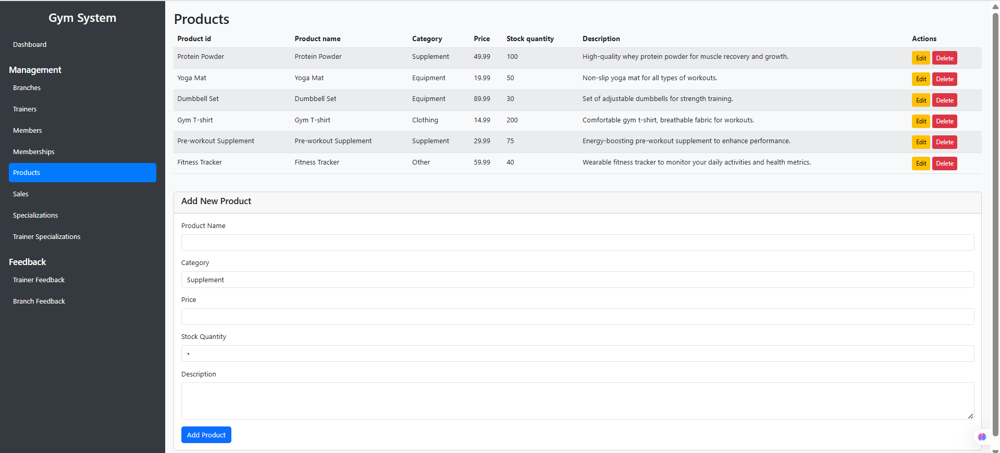
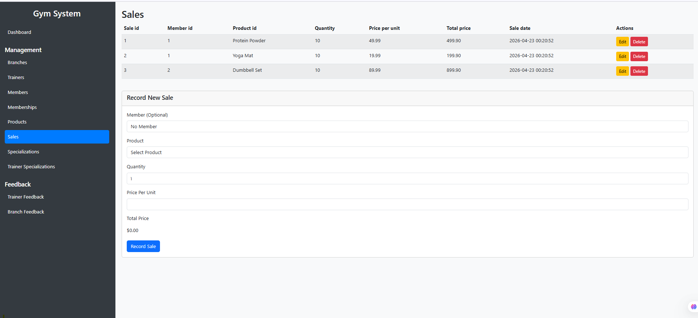
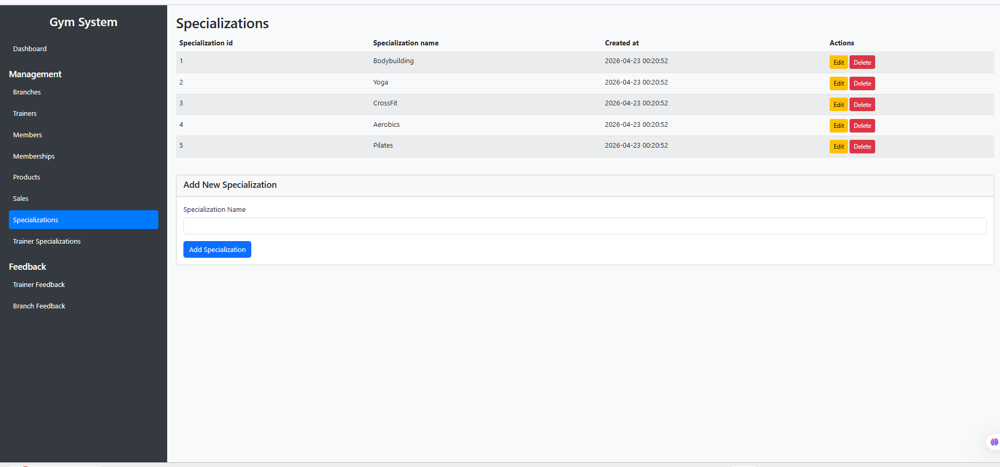
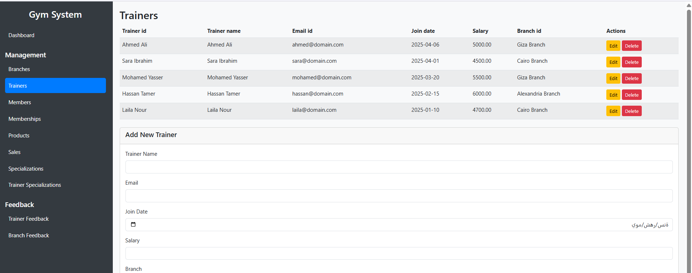

# Gym System

**Gym System** is a PHP and MySQL **admin dashboard** for managing a gym operation end-to-end.  
It supports core administrative workflows such as branches, trainers, members, membership plans, products, sales, trainer specialization assignment, and feedback management.

> This project is an **admin-only CRUD system**. It does **not** include login or registration.

---

## Project Structure

The project is organized using a modular PHP structure, separating form logic, database setup, and documentation assets for better maintainability and scalability.

```

Gym-Management-Dashboard/
│
├── forms/
│   ├── branches_form.php
│   ├── feedback_branches_form.php
│   ├── feedback_trainers_form.php
│   ├── members_form.php
│   ├── memberships_form.php
│   ├── products_form.php
│   ├── sales_form.php
│   ├── specializations_form.php
│   ├── trainer_specializations_form.php
│   └── trainers_form.php
│
├── images/
│   ├── Branch Feedback.png
│   ├── Branchs.png
│   ├── Dashboard.png
│   ├── Members.png
│   ├── Memberships.png
│   ├── Products.png
│   ├── Sales.png
│   ├── Specializations.png
│   ├── Trainer Feedback.png
│   ├── Trainer Specializations.png
│   └── Trainers.png
│
├── dashboard.php
├── index.php
├── gym_db.sql
├── Gym_System_README.md

```


## Features

- **Dashboard overview**
  - Total branches, members, trainers, and monthly sales insights
  - Recent members and recent sales
  - Membership expiration alerts
  - Low stock alerts
  - Branch performance summary

- **Branch management**
  - Add, edit, delete, and list gym branches
  - Store branch name, address, and creation time

- **Trainer management**
  - Add, edit, delete, and list trainers
  - Track trainer email, join date, salary, and branch assignment

- **Member management**
  - Add, edit, delete, and list members
  - Store personal data, body metrics, contact information, branch, trainer, and membership plan
  - Automatically calculate membership end date based on the selected plan duration

- **Membership plan management**
  - Create and manage subscription plans
  - Define plan name, price, and duration in months

- **Product management**
  - Manage gym products by category
  - Track price, stock quantity, and description

- **Sales tracking**
  - Record product sales
  - Calculate total price automatically
  - Track quantity, unit price, and sale date

- **Specialization management**
  - Maintain trainer specialization categories

- **Trainer specialization assignment**
  - Assign one or more specializations to trainers

- **Feedback management**
  - Collect and manage feedback for trainers and branches
  - Store ratings and comments
  - Keep feedback history with dates

---

## Tech Stack

- **Backend:** Native PHP
- **Database:** MySQL
- **Frontend:** HTML, CSS, JavaScript
- **Local server:** XAMPP
- **Development tools:** VS Code / phpMyAdmin

---

## Database Design

The system is built around a relational database with strong referential integrity.

### Main Tables

- **branches**
  - Stores gym branch information
  - Fields: branch name, address, created time

- **trainers**
  - Stores trainer details
  - Linked to one branch using a foreign key

- **specializations**
  - Stores trainer specialization names such as Bodybuilding, Yoga, and CrossFit

- **trainer_specializations**
  - Junction table for the many-to-many relationship between trainers and specializations

- **memberships**
  - Stores subscription plans with price and duration

- **members**
  - Stores member personal data, body measurements, branch, trainer, and membership plan
  - Uses constraints for weight, height, unique phone number, and unique email

- **products**
  - Stores product catalog, category, price, stock, and description
  - Stock quantity is constrained to never go below zero

- **sales**
  - Stores product sales history
  - Total price is calculated automatically as `quantity * price_per_unit`

- **feedback_trainers**
  - Stores ratings and comments for trainers

- **feedback_branches**
  - Stores ratings and comments for branches

### Important Relationships

- A **branch** can have many **trainers**
- A **branch** can have many **members**
- A **trainer** can be linked to many **members**
- A **trainer** can have many **specializations**
- A **membership plan** can be assigned to many **members**
- A **product** can appear in many **sales**
- A **member** can submit feedback for trainers and branches

---

## Constraints and Business Rules

- Member weight must be between **30 and 300**
- Member height must be between **100 and 250**
- Ratings must be between **1 and 5**
- Product price must be greater than **1**
- Stock quantity must be **0 or greater**
- Phone number and email are **unique**
- Sales total is **auto-generated**
- Deleting a branch sets related trainer references to `NULL` where applicable
- Deleting a member cascades related feedback records
- Deleting a membership plan is restricted if it is already assigned to members

---

## Installation & Setup

### 1. Install XAMPP
Install XAMPP and start:
- **Apache**
- **MySQL**

### 2. Place the project in `htdocs`
Copy the project folder into:

```bash
xampp/htdocs/
```

### 3. Create the database
Open **phpMyAdmin** and create a database named:

```sql
gym_db
```

### 4. Import the SQL file
Import the provided MySQL script into `gym_db`.

### 5. Configure the database connection
Update the PHP connection file with your local credentials, typically:

```php
$host = "localhost";
$user = "root";
$password = "";
$database = "gym_db";
```

### 6. Run the project
Open the project in the browser through localhost, for example:

```bash
http://localhost/Gym-Management-Dashboard/
```

or open the main entry file used by the project.

---

## Usage

### Scenario 1: Add a New Member
1. Open the **Members** page
2. Fill in the member’s personal data
3. Select the branch
4. Optionally assign a trainer
5. Choose the membership plan
6. Submit the form
7. The system saves the member and calculates the membership end date automatically

### Scenario 2: Record a Product Sale
1. Open the **Sales** page
2. Choose a member or keep it optional
3. Select a product
4. Enter quantity and unit price
5. The system calculates the total price automatically
6. Save the sale record
7. Inventory and sales history are updated

### Scenario 3: Collect Feedback
1. Open **Trainer Feedback** or **Branch Feedback**
2. Select the member
3. Choose the trainer or branch
4. Enter rating and comments
5. Submit the feedback

---

## Screenshots

> Put the screenshots inside an `images` folder at the project root, using the exact filenames below.

| Page | Screenshot |
|------|------------|
| Dashboard |  |
| Branches |  |
| Members |  |
| Memberships |  |
| Products |  |
| Sales |  |
| Specializations |  |
| Trainer Specializations |  |
| Trainer Feedback |  |
| Branch Feedback |  |
| Trainers |  |

---

## Challenges and Lessons Learned

This project demonstrates practical experience with:

- Designing a normalized relational database
- Managing one-to-many and many-to-many relationships
- Enforcing data integrity using foreign keys and constraints
- Handling optional relationships such as nullable trainer or member references
- Automating derived data such as membership end dates and sale totals
- Building a clean admin workflow for CRUD operations

The biggest lesson from the project is that a solid database design makes the application logic much easier to maintain.

---

## Future Improvements

Possible next steps:

- Add authentication and role-based access control
- Add search, filters, and pagination for large datasets
- Add export features such as PDF / Excel reports
- Add visual analytics charts on the dashboard
- Add REST APIs for future frontend or mobile integration
- Migrate the project to a framework such as Laravel for better structure and scalability

---

## Project Summary

Gym System is a practical PHP/MySQL admin dashboard built to manage a gym’s daily operations from a single interface. It covers branches, trainers, members, memberships, products, sales, specialization assignment, and feedback collection in one organized system.
